# Chores IOT

Sample application for Scott Hanselman's Developer Keynote at Microsoft Ignite 2020.

# Table of contents

- [Application Screens](#screens)
- [Application Diagram](#diagram)
- [Getting Started](#getting-started)
- [Deploy to Azure](#deployment-scenarios)
- [Contributing](#contributing)

# <a name="screens"></a>Application Screens

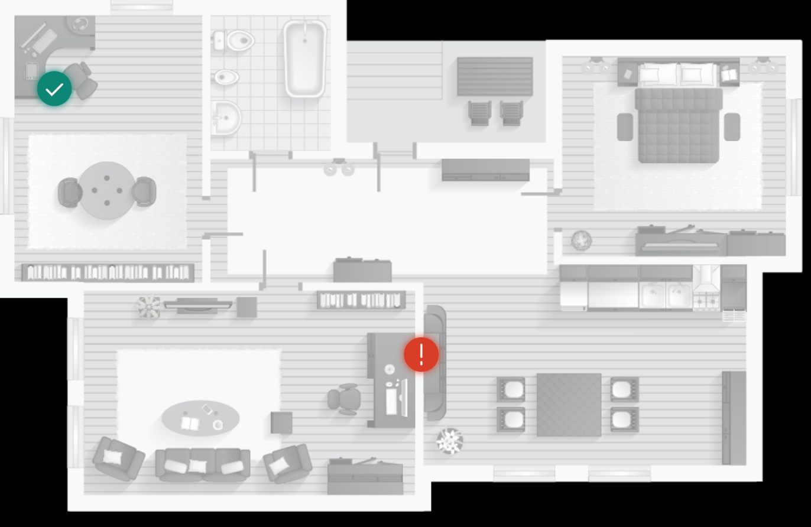
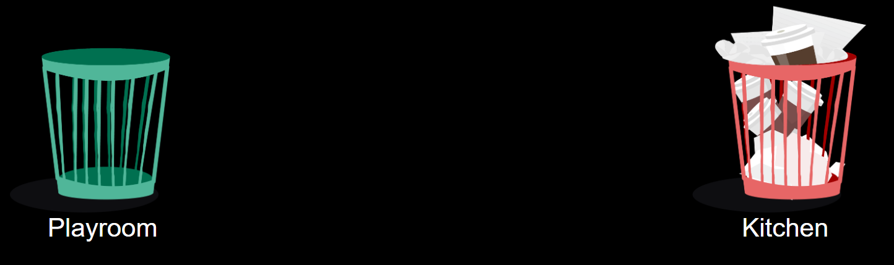

# <a name="diagram"></a>Application Diagram

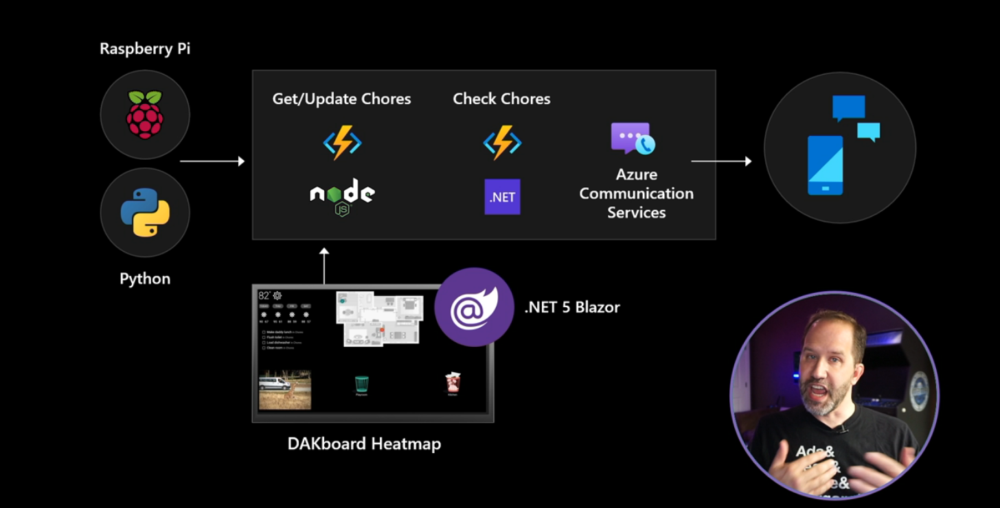


# <a name="getting-started"></a>Getting Started

## Pre-Requisites

1. You will need [Visual Studio 2019](https://visualstudio.microsoft.com/vs/) Version 16.8.0 Preview 3.1 on Windows 10.
1. You will need [Docker Desktop](https://www.docker.com/products/docker-desktop).

If you want to deploy this solution in Azure:

1. You will need and Azure Subscription in order to deploy this.
1. Azure CLI.
1. Download and install helm.

## New to Microsoft Azure?

You will need an Azure subscription to work with this demo code. You can:

- Open an account for free [Azure subscription](https://azure.microsoft.com/free/). You get credits that can be used to try out paid Azure services. Even after the credits are used up, you can keep the account and use free Azure services and features, such as the Web Apps feature in Azure App Service.
- [Activate Visual Studio subscriber benefits](https://azure.microsoft.com/pricing/member-offers/credit-for-visual-studio-subscribers/). Your Visual Studio subscription gives you credits every month that you can use for paid Azure services.
- Create an [Azure Student Account](https://azure.microsoft.com/free/students/) and get free credit when you create your account.

Learn more about it with [Microsoft Learn - Introduction to Azure](https://docs.microsoft.com/learn/azure).

# <a name="deployment-scenarios"></a>Deploy to Azure

Chores IOT takes advantage of the following services in Azure

- [Azure Communication Services](https://azure.microsoft.com/services/communication-services/)
- [Azure Functions](https://docs.microsoft.com/azure/azure-functions/)
- [Azure Static Web Apps](https://docs.microsoft.com/azure/static-web-apps/)
- [Azure Logic Apps](https://azure.microsoft.com/services/logic-apps/)
- [Azure Event Grid](https://azure.microsoft.com/services/event-grid/)

Referencing the Architecture Diagram above, the application consists of 3 seperate Azure Functions (2 written in Node.js, the other in C#), an ASP.NET Web-Assembly based Blazor website hosted in Azure Static Web Apps and a script deployed to a Raspberry Pi (in this case, [Pi-Top](https://www.pi-top.com/)) written in Python. Finally, to configure the SMS Communication, as well as Azure Logic Apps and Azure Event Grid.

## Setting up ACS

Setting up Azure Communication Services is done in the Azure Portal, by searching for the service, entering resource information and creating.

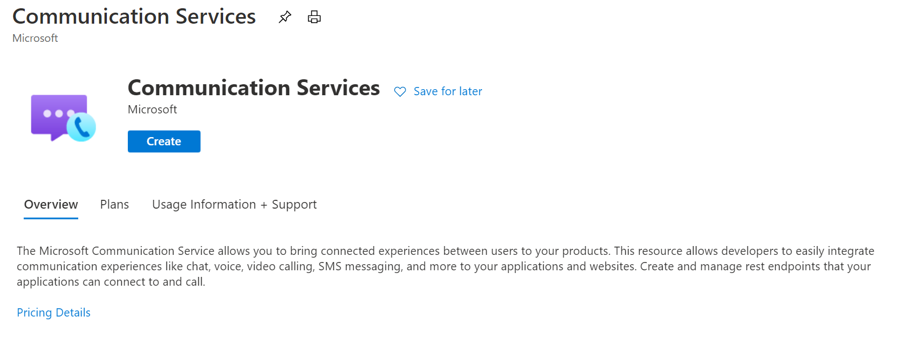
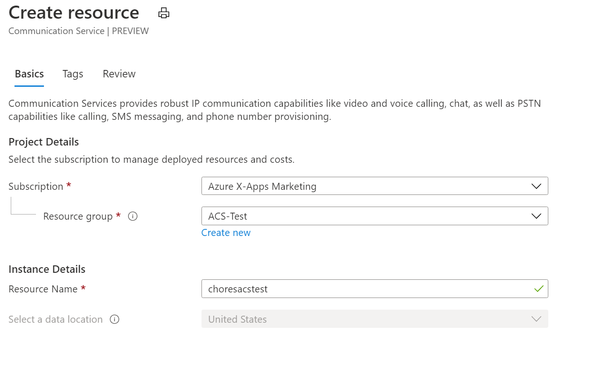

Once the resource is created, you will need to Add a Phone Number

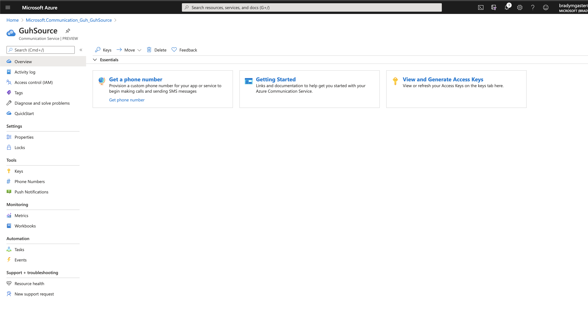

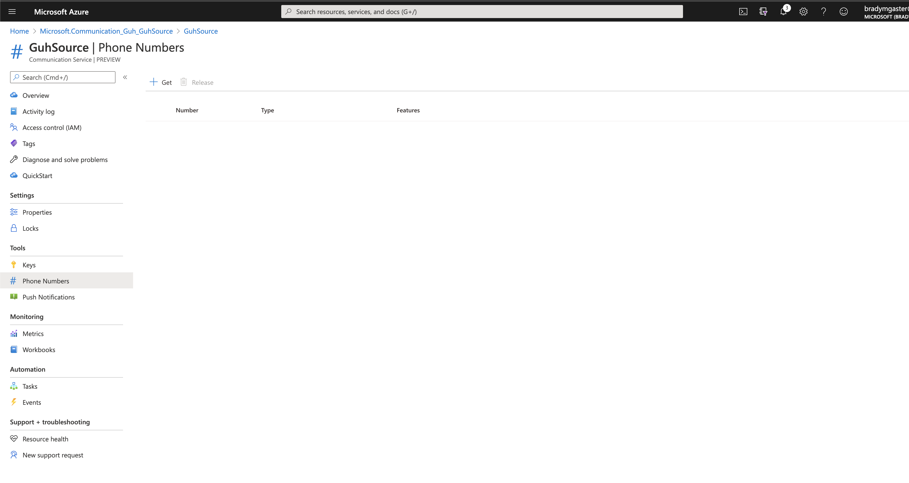

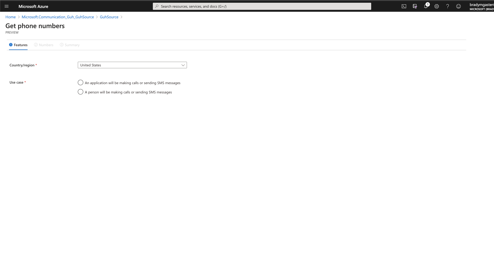

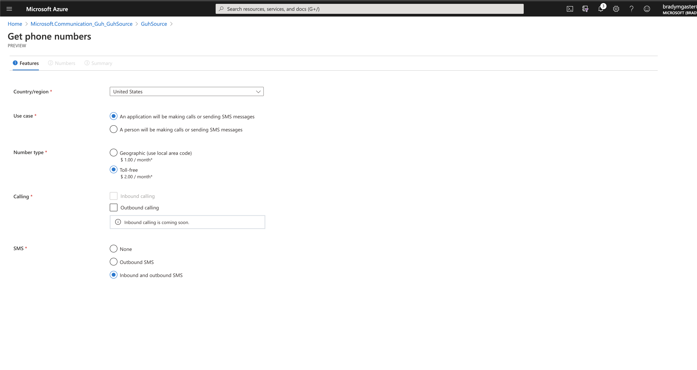

And create an Azure Event Grid Subscription for Delivery Reports with Logic Apps

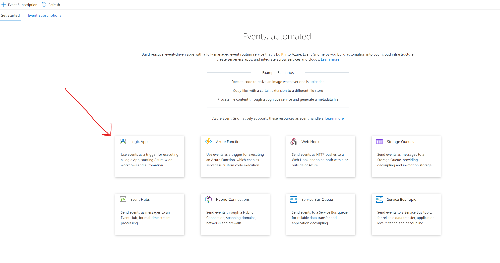

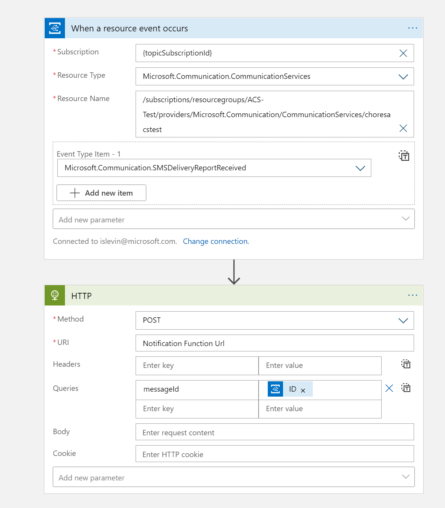

## Deploying Azure Functions

### Chore Function (Typescript)

You can seamlessly deploy a Node.js-based Azure Function using Visual Studio Code and the Azure Functions Extension.

1. Choose the Azure icon in the Activity bar, then in the Azure: Functions area, choose the Deploy to function app... button.


2. Provide the following information at the prompts:

    - Select folder: Choose a folder from your workspace or browse to one that contains your function app. You won't see this if you already have a valid function app opened.

    - Select subscription: Choose the subscription to use. You won't see this if you only have one subscription.

    - Select Function App in Azure: Choose - Create new Function App. (Don't choose the Advanced option, which isn't covered in this article.)

    - Enter a globally unique name for the function app: Type a name that is valid in a URL path. The name you type is validated to make sure that it's unique in Azure Functions.

    - Select a runtime: Choose the version of Node.js you've been running on locally. You can use the node --version command to check your version.
Select a location for new resources: For better performance, choose a region near you.

3. When completed, the following Azure resources are created in your subscription, using names based on your function app name:

    - A resource group, which is a logical container for related resources.
    - A standard Azure Storage account, which maintains state and other information about your projects.
    - A consumption plan, which defines the underlying host for your serverless function app.
    - A function app, which provides the environment for executing your function code. A function app lets you group functions as a logical unit for easier management, deployment, and sharing of resources within the same hosting plan.
    - An Application Insights instance connected to the function app, which tracks usage of your serverless function.
A notification is displayed after your function app is created and the deployment package is applied.

4. Select View Output in this notification to view the creation and deployment results, including the Azure resources that you created. If you miss the notification, select the bell icon in the lower right corner to see it again.


### Notification Function (C#)

The preferred way to deploy the Notification Azure Function is to configure CI/CD for it. With Visual Studio 2019 16.8 Preview 3 and later, you can now generate a GitHub Action directly from Visual Studio, which configures CI/CD for your applicaitons on commit. To do this, simply right-click on the project and publish.

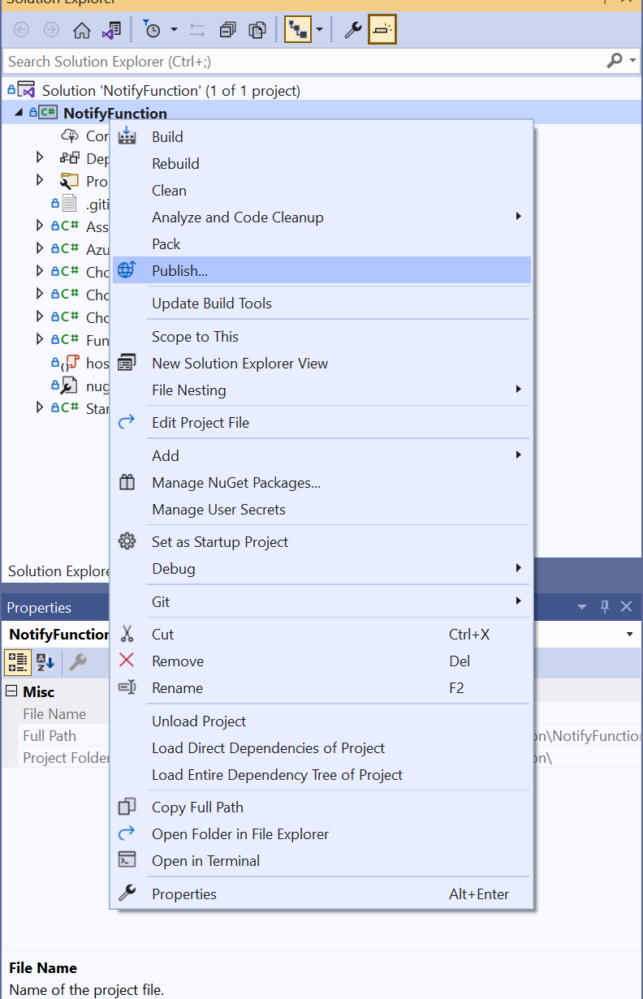


Follow the wizard to deploy the Azure Function, and the last step you will be given the option to generate a publishing profile (think traditional right-click publish) or a generate a workflow file, which will create a github action that will be commited to your repo.

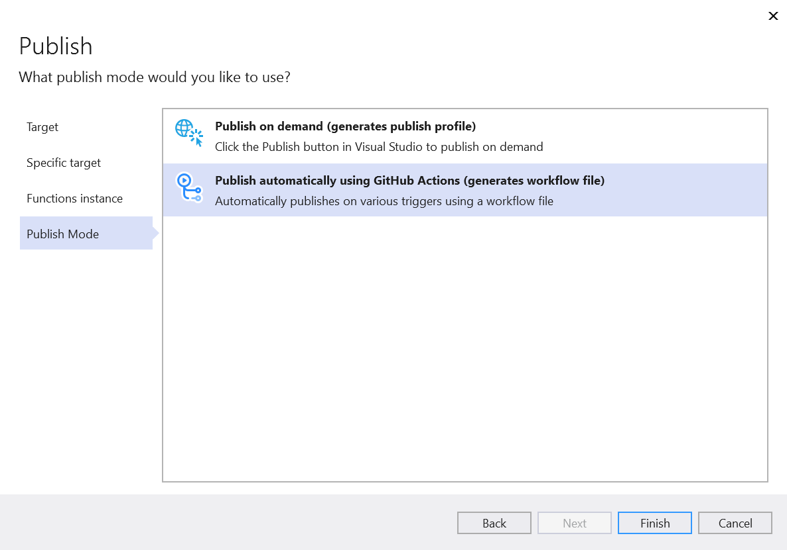

After clicking finish you will be able to review the new GitHub Action workflow file that was generated, whcih will look similar to

```yaml
name: Deploy Function App (.NET Core) to acs-notify
on:
  push:
    branches:
    - main
env:
  AZURE_FUNCTIONAPP_NAME: acs-notify
  AZURE_FUNCTIONAPP_PACKAGE_PATH: .
  AZURE_FUNCTIONAPP_PUBLISH_PROFILE: ${{ secrets.ACS_NOTIFY_PUBLISH_PROFILE }}
  CONFIGURATION: Release
  DOTNET_CORE_VERSION: 3.1.x
  PROJECT_PATH: .
jobs:
  build-and-deploy:
    runs-on: windows-latest
    steps:
    - name: Checkout GitHub Action
      uses: actions/checkout@master
    - name: Setup .NET Core SDK ${{ env.DOTNET_CORE_VERSION }}
      uses: actions/setup-dotnet@v1
      with:
        dotnet-version: ${{ env.DOTNET_CORE_VERSION }}
    - name: Resolve Project Dependencies Using Dotnet
      run: >
        pushd "./${{ env.AZURE_FUNCTIONAPP_PACKAGE_PATH }}"

        dotnet build "{{ env.PROJECT_PATH }}" --configuration ${{ env.CONFIGURATION }} --output "./output"

        popd
      shell: pwsh
    - name: Run Azure Functions Action
      uses: Azure/functions-action@v1
      with:
        app-name: ${{ env.AZURE_FUNCTIONAPP_NAME }}
        publish-profile: ${{ env.AZURE_FUNCTIONAPP_PUBLISH_PROFILE }}
        package: ${{ env.AZURE_FUNCTIONAPP_PACKAGE_PATH }}/output
```

There will also be a environment file created alongside. It will be your responsibility to add any additional GitHub secrets to your repo if needed.

### Loading Script on Raspberry Pi

**Note: This script will only work using a Pi-Top, you will need to update to run with a regular Pi with a GPIO array.

Using SSH/SCP or Visual Studio Code, copy the `updateChoresFromSensor.py` and `config.py` files to your Raspberry Pi. After that, you will need to update `config.py` to match your configuration

```python
get_url = ''
post_url = ''
sensor_port = ''
greenlight_port = ''
redlight_port = ''
distance_threshold = 0
over_threshold_status = 0
under_threshold_status = 0
```

After that, you should be able to run the script and see the Chores data get updated. You can start the script from bash with

```bash
python updateChoresFromSensor.py
```

### Deploying HeatMap

Finally, we will deploy the .NET Core Blazor Web-Assembly based UI to see the heatmap in action. You can deploy the app to one of the following hosting options in Azure

- App Service (any option, including container)
- Static Site hosted in Azure Blob Storage
- Azure Static Web Apps

For the Ignite Keynote, we took advantage of new support of .NET Core Blazor in Azure Static Web Apps. When we create an Azure Static Web App, we point it at a GitHub repo and it automatically configures a GitHub Action that will link your repo to the instance of SWA. After you connect the SWA to your repo, it will generate a GitHub Action Workflow. For instance, here is the one that was used for the Ignite Keynote

```yaml
name: Azure Static Web Apps CI/CD

on:
  push:
    branches:
      - main
  pull_request:
    types: [opened, synchronize, reopened, closed]
    branches:
      - main

jobs:
  build_and_deploy_job:
    if: github.event_name == 'push' || (github.event_name == 'pull_request' && github.event.action != 'closed')
    runs-on: ubuntu-latest
    name: Build and Deploy Job
    steps:
      - uses: actions/checkout@v2
        with:
          submodules: true
          
     
      - name: Setup .NET Core SDK
        uses: actions/setup-dotnet@v1.6.0
        with:
          # SDK version to use. Examples: 2.2.104, 3.1, 3.1.x
          dotnet-version: '5.0.100-rc.1.20452.10'
          
      - name: Build App
        run: dotnet publish -c Release -o src/HeatMap/published src/HeatMap/HeatMap.csproj

     
      - name: Build And Deploy
        id: builddeploy
        uses: Azure/static-web-apps-deploy@v0.0.1-preview
        with:
          azure_static_web_apps_api_token: ${{ secrets.AZURE_STATIC_WEB_APPS_API_TOKEN_VICTORIOUS_MOSS_031B5941E }}
          repo_token: ${{ secrets.GITHUB_TOKEN }} 
          app_location: "src/HeatMap/published/wwwroot" 
          api_location: "" 
          app_artifact_location: "" 
  close_pull_request_job:
    if: github.event_name == 'pull_request' && github.event.action == 'closed'
    runs-on: ubuntu-latest
    name: Close Pull Request Job
    steps:
      - name: Close Pull Request
        id: closepullrequest
        uses: Azure/static-web-apps-deploy@v0.0.1-preview
        with:
          azure_static_web_apps_api_token: ${{ secrets.AZURE_STATIC_WEB_APPS_API_TOKEN_VICTORIOUS_MOSS_031B5941E }}
          action: "close"
```

As mentioned previously, you will need to add GitHub secrets to your repo. 

# Contributing

This project welcomes contributions and suggestions.  Most contributions require you to agree to a
Contributor License Agreement (CLA) declaring that you have the right to, and actually do, grant us
the rights to use your contribution. For details, visit https://cla.opensource.microsoft.com.

When you submit a pull request, a CLA bot will automatically determine whether you need to provide
a CLA and decorate the PR appropriately (e.g., status check, comment). Simply follow the instructions
provided by the bot. You will only need to do this once across all repos using our CLA.

This project has adopted the [Microsoft Open Source Code of Conduct](https://opensource.microsoft.com/codeofconduct/).
For more information see the [Code of Conduct FAQ](https://opensource.microsoft.com/codeofconduct/faq/) or
contact [opencode@microsoft.com](mailto:opencode@microsoft.com) with any additional questions or comments.
